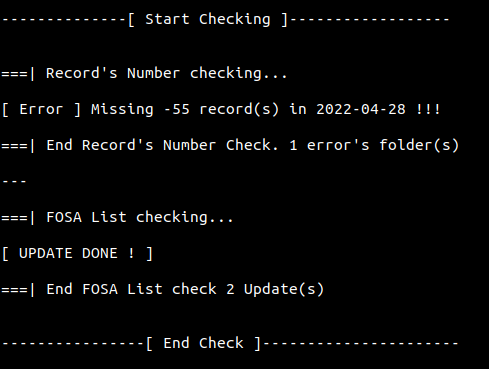

# InterOperability

### This script is used to

<ul>
    <li>Verify that all datas are received</li>
    <li>split each declare in it corresponding CEC.</li>
    <li>Give statistical infos</li>
    <li>Share datas in a Sync Folder</li>
</ul>

## Verify <h6>output</h6>



## Segmentation <h6>output</h6>


## How to use ?

Just run this bash file

```
./verify.sh 
```
